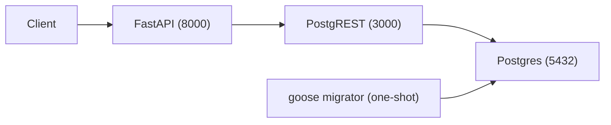

# poc-postgrest

Proof of concept for an API built Postgres-first with [PostgREST], [FastAPI],
[goose] migrations, and [Pydantic] validation.

## Architecture



- **Postgres 17** stores the data in the `app` schema.
- **goose** applies SQL migrations from `migrations/` as a one-shot service.
- **PostgREST** exposes the `app` schema as a REST API on port `3000` using the
  `web_anon` role.
- **FastAPI** (served by [Granian]) runs on port `8000`. It performs Pydantic
  validation and custom business logic (for example, rejecting a double
  complete with `409 Conflict`), then reads and writes through PostgREST.

## Run

```sh
docker compose up --build
```

The migrator service exits `0` once migrations are applied; `postgrest` and
`api` start afterwards.

## Endpoints

| Method | Path                   | Description                                  |
| ------ | ---------------------- | -------------------------------------------- |
| GET    | `/tasks`               | List all tasks.                              |
| POST   | `/tasks`               | Create a task (`{"title": "..."}`).          |
| GET    | `/tasks/{id}`          | Read a single task.                          |
| POST   | `/tasks/{id}/complete` | Complete a task; `409` if already completed. |

PostgREST is also reachable directly on port `3000` (`GET /tasks`, etc.).

## Validate

Open `poc.http` in an IntelliJ REST client (or VS Code REST Client) and
run the requests in order. The collection exercises the full flow through
FastAPI and confirms writes propagated by reading directly from PostgREST.

## Migrations

Migrations live in `migrations/` and are managed with the goose CLI:

```sh
goose -dir migrations create <name> sql   # create a new migration
goose -dir migrations postgres "$DATABASE_URL" up     # apply
goose -dir migrations postgres "$DATABASE_URL" status # check state
```

[PostgREST]: https://postgrest.org
[FastAPI]: https://fastapi.tiangolo.com
[goose]: https://github.com/pressly/goose
[Pydantic]: https://pydantic.dev
[Granian]: https://github.com/emmett-framework/granian
