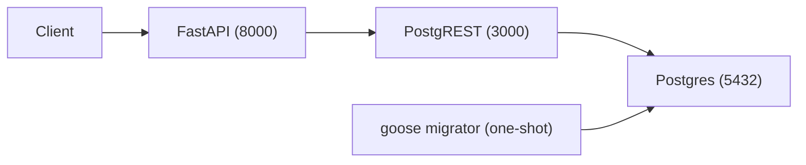

# poc-postgrest

Proof of concept for an API built Postgres-first with [PostgREST], [FastAPI], [goose] migrations, and [Pydantic] validation.

## Architecture



- **Postgres 17** stores the data in the `app` schema.
- **goose** applies SQL migrations from `migrations/` as a one-shot service.
- **PostgREST** exposes the `app` schema as a REST API on port `3000` using the `web_anon` role.
- **FastAPI** (served by [Granian]) runs on port `8000`. It performs Pydantic validation and custom business logic (for example, rejecting a double complete with `409 Conflict`), then reads and writes through PostgREST.

## Run

```sh
docker compose up --build
```

The migrator service exits `0` once migrations are applied; `postgrest` and `api` start afterwards.

## Endpoints

| Method | Path                          | Description                                                            |
| ------ | ----------------------------- | ---------------------------------------------------------------------- |
| GET    | `/tasks`                      | List all tasks; optional `?tag=` jsonb filter.                         |
| GET    | `/tasks/search?q=`            | Full-text search over title and description.                           |
| POST   | `/tasks`                      | Create a task (`title`, optional `description`, `tags`, `project_id`). |
| GET    | `/tasks/{id}`                 | Read a single task.                                                    |
| POST   | `/tasks/{id}/complete`        | Complete a task; `409` if already completed.                           |
| GET    | `/projects`                   | List projects with tasks embedded (PostgREST join).                    |
| POST   | `/projects`                   | Create a project (`name`).                                             |
| GET    | `/projects/{id}/summary`      | Task counts by status (custom aggregation).                            |
| POST   | `/projects/{id}/complete-all` | Atomically complete all pending tasks via a Postgres RPC.              |

PostgREST is also reachable directly on port `3000`. Full-text search uses the `search_vector=fts.<term>` operator, jsonb tag filtering uses `tags=cs.["<tag>"]` (containment), project-task joins use `select=*,tasks(*)` (embedded resources), and `POST /rpc/complete_all_tasks` calls the atomic Postgres function.

The schema also demonstrates a native `task_status` ENUM, a `BEFORE UPDATE` trigger that auto-maintains `updated_at`, and the `complete_all_tasks` `SECURITY DEFINER` RPC.

## Validate

`poc.hurl` is a [Hurl] test file with built-in assertions. Run it against the stack:

```sh
hurl --test poc.hurl
```

It is idempotent (cleans up after itself) and exercises the full flow through FastAPI, confirming writes propagated by reading directly from PostgREST.

## Migrations

Migrations live in `migrations/` and are managed with the goose CLI:

```sh
goose -dir migrations create <name> sql   # create a new migration
goose -dir migrations postgres "$DATABASE_URL" up     # apply
goose -dir migrations postgres "$DATABASE_URL" status # check state
```

[PostgREST]: https://postgrest.org
[FastAPI]: https://fastapi.tiangolo.com
[goose]: https://github.com/pressly/goose
[Pydantic]: https://pydantic.dev
[Granian]: https://github.com/emmett-framework/granian
[Hurl]: https://hurl.dev
